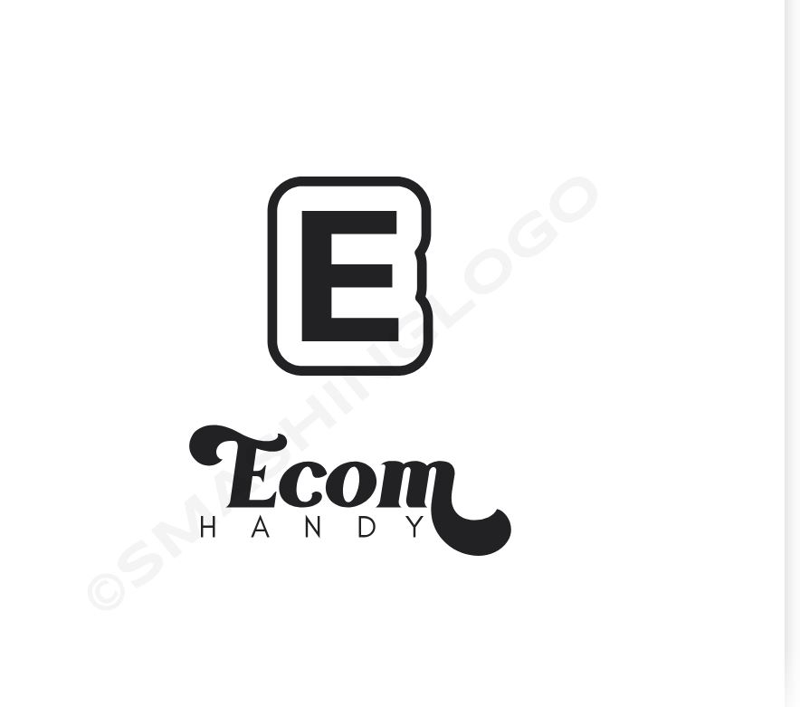
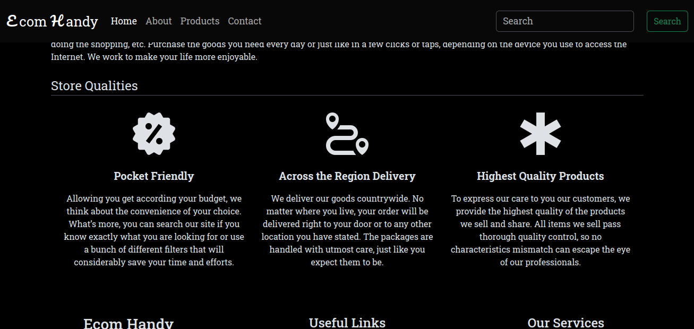

# Ecom Handy

## Introduction

Our project, ECOMHANDY, is an e-commerce platform designed to provide users with a seamless shopping experience. 
It aims to connect consumers with a wide range of products while offering a user-friendly interface for easy navigation and purchase.

ECOMHANDY was created for online shoppers seeking a convenient and efficient platform to browse and purchase products across various categories.

It was created by a team of two creative minds
- Guav Anemba [Linkedn](https://www.linkedin.com/in/guav-gharddammez-a25a29278?utm_source=share&utm_campaign=share_via&utm_content=profile&utm_medium=android_app), [Github](https://github.com/Gharddammez)
- Ephesians Ochieng [Linkedn](https://www.linkedin.com/in/ephesians-ochieng-okoth-a14955262/), [Github](https://github.com/quiesscent)

View our [blog]() article here and our site [here]()

## Installation and Usage

Our project is not a mobile application and can only run on web browsers cause it is a web application. Even though it is not a web application, it is designed with our team to work responsively on mobile phones givin our users the best experience.
Planning to make the mobile application as we continue to grow. We ought to give our users a seamless workflow.

## Contributing and Related Projects

We have no contributors on our project apart from the two members. Nevertheless all are welcomed to contribute for the greater good of the project

On matters related projects we have, Jumia, Jiji, Amazon and many others offering the same services we offer but we ought deliver more efficiently compared to 95% of the platforms

## License

This is our original project and has no duplication whatsoever

